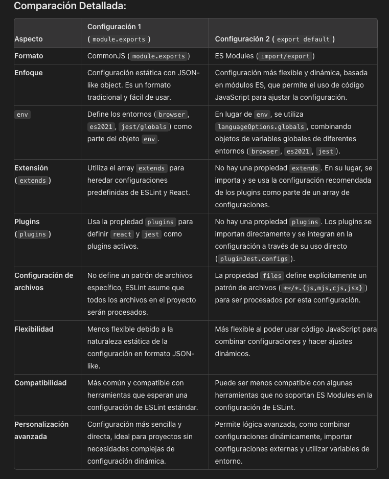

## Instalacion de Eslint:

        npm install eslint --save-dev

## Configurar proyecto con Eslint:

        npx eslint --init

    o

        npm init @eslint/config@latest

#### How would you like to use ESLint?
- To check syntax only
- To check syntax and find problems
- To check syntax, find problems, and enforce code style

#### What type of modules does your project use?
- JavaScript modules (import/export)
- CommonJS (require/exports)

#### Which framework does your project use?
- React
- Vue
- None of these

#### Does your project use TypeScript? 
- Yes
- No

#### Where does your code run? 
- Browser
- Node

#### The config that you've selected requires the following dependencies:

*'Tu seleccion de las respuestas anteriores'*

#### Would you like to install them now?
- Yes
- No

## Problemas al instalar ESlint:

sample.test.js

describe("testear funcion add", () => {  'describe' is not defined
    it("add 1 + 2 should be 3", () => { ' it '  is not defined
        expect(add(1, 2)).toBe(3); ' expect'  is not defined
    });
    it("add 1 + -2 should be -1", () => {  ' it '  is not defined
        expect(add(1, -2)).toBe(3);  'describe' is not defined
    });
}); // test suites

## Solucionando el problema:

        npm install eslint-plugin-jest --save-dev

## Configuracion en un archivo 'eslint.config.js'

import globals from "globals";
import pluginJs from "@eslint/js";
import pluginReact from "eslint-plugin-react";
import pluginJest from "eslint-plugin-jest"; // Importar el plugin de Jest

export default [
    {
        files: ["**/*.{js,mjs,cjs,jsx}"],
    },
    {
        languageOptions: {
            globals: {
                ...globals.browser,
                ...globals.es2021,
                ...globals.jest, // Integrar los globals de Jest
            },
            ecmaVersion: "latest",
            sourceType: "module",
        },
    },
    pluginJs.configs.recommended,
    pluginReact.configs.flat.recommended,
    pluginJest.configs.recommended, // Añadir la configuración recomendada de Jest
];

## Configuracion en un archivo ".eslintrc.json":

// {
//   "env": {
//     "browser": true,
//     "es2021": true,
//     "jest/globals": true
//   },
//   "extends": [
//     "eslint:recommended",
//     "plugin:react/recommended"
//   ],
//   "parserOptions": {
//     "ecmaVersion": "latest",
//     "sourceType": "module"
//   },
//   "plugins": [
//     "react",
//     "jest"
//   ],
//   "rules": {
//     // Puedes agregar tus reglas personalizadas aquí
//   }
// }

### Comparacion detallada '.eslintrc.json' VS 'eslint.config.js'

